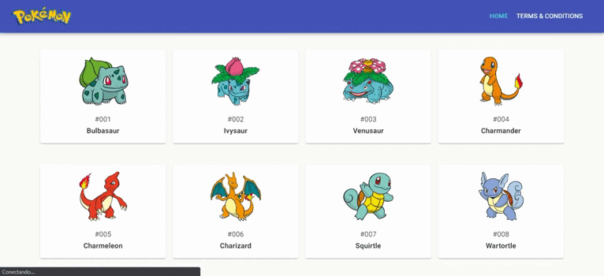

# Getting Started with Create React App

This project was bootstrapped with [Create React App](https://github.com/facebook/create-react-app).

### TO-DO
1. Aplicando Single-responsibility principle de
   los principios SOLID refactorizar la siguiente
   aplicación
2. Implementar un custom hook para la carga
   inicial de datos e implementar una paginación
   Aqui se puede encontrar la documentación
   sobre el API de pokemons implementado
   https://pokeapi.co/docs/v2
3. Cada Nombre de PokemonPage debe ser clickable
   y mostrar la información del pokemon
   (imagen, nombre, movimientos, tipos) en una página
   nueva, implementar la lógica necesaria
   para obtener dicha información obtenida del api
   antes mencionado https://pokeapi.co/docs/v2
4. Cada uno de los movimientos del pokemon
   deben ser clickable y debe llevar a una
   página nueva donde se muestre la descripcion de los
   campos effect y short_effect de effect_entries
   power y acurracy

Nota: para la navegación se usa react-router-dom
aquí se puede consultar el API https://v5.reactrouter.com/web/guides/quick-start
5. Darle una interfaz más agradable (A su gusto)
   importante darle una migas (Breadcrumbs)
   a la actual aplicación para lo cual se usa material UI
   la version 4.x.x aqui se puede ver la
   documentación https://v4.mui.com/
6. Implementar página 404 para cualquier página
   inexistente
7. Implementar los test unitarios que sean
   convenientes, para lo cual se usa JEST,
   testing-library/react, testing-library/hooks,
   axios-mock-adapter

## Demo
   
   

## Available Scripts

In the project directory, you can run:

### `npm start`

Runs the app in the development mode.\
Open [http://localhost:3000](http://localhost:3000) to view it in your browser.

The page will reload when you make changes.\
You may also see any lint errors in the console.

### `npm test`

Launches the test runner in the interactive watch mode.\
See the section about [running tests](https://facebook.github.io/create-react-app/docs/running-tests) for more information.

### `npm run build`

Builds the app for production to the `build` folder.\
It correctly bundles React in production mode and optimizes the build for the best performance.

The build is minified and the filenames include the hashes.\
Your app is ready to be deployed!

See the section about [deployment](https://facebook.github.io/create-react-app/docs/deployment) for more information.

### `npm run eject`

**Note: this is a one-way operation. Once you `eject`, you can't go back!**

If you aren't satisfied with the build tool and configuration choices, you can `eject` at any time. This command will remove the single build dependency from your project.

Instead, it will copy all the configuration files and the transitive dependencies (webpack, Babel, ESLint, etc) right into your project so you have full control over them. All of the commands except `eject` will still work, but they will point to the copied scripts so you can tweak them. At this point you're on your own.

You don't have to ever use `eject`. The curated feature set is suitable for small and middle deployments, and you shouldn't feel obligated to use this feature. However we understand that this tool wouldn't be useful if you couldn't customize it when you are ready for it.

## Learn More

You can learn more in the [Create React App documentation](https://facebook.github.io/create-react-app/docs/getting-started).

To learn React, check out the [React documentation](https://reactjs.org/).

### Code Splitting

This section has moved here: [https://facebook.github.io/create-react-app/docs/code-splitting](https://facebook.github.io/create-react-app/docs/code-splitting)

### Analyzing the Bundle Size

This section has moved here: [https://facebook.github.io/create-react-app/docs/analyzing-the-bundle-size](https://facebook.github.io/create-react-app/docs/analyzing-the-bundle-size)

### Making a Progressive Web App

This section has moved here: [https://facebook.github.io/create-react-app/docs/making-a-progressive-web-app](https://facebook.github.io/create-react-app/docs/making-a-progressive-web-app)

### Advanced Configuration

This section has moved here: [https://facebook.github.io/create-react-app/docs/advanced-configuration](https://facebook.github.io/create-react-app/docs/advanced-configuration)

### Deployment

This section has moved here: [https://facebook.github.io/create-react-app/docs/deployment](https://facebook.github.io/create-react-app/docs/deployment)

### `npm run build` fails to minify

This section has moved here: [https://facebook.github.io/create-react-app/docs/troubleshooting#npm-run-build-fails-to-minify](https://facebook.github.io/create-react-app/docs/troubleshooting#npm-run-build-fails-to-minify)
